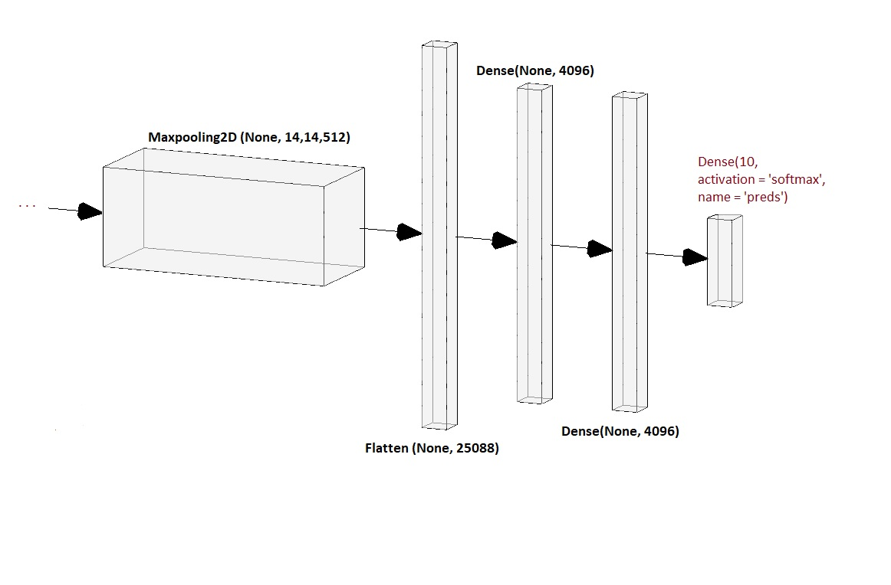

# Probing the notMNIST dataset
---
## About the data:
The data set consists of glyphs taken from publically available fonts. There are 10 classes A,B...J. Blow are a few axamples of A

There are two variants, notMnist Large, which is not clean and consits of about 500k glyphs of each class and notMnistsmall, which is handpicked to be more clean, have about 1,800 glyphs per class. both parts have approximately 0.5% and 6.5% label error rate. [[1](#blog_dest)] 

## Abstract:
*An attempt to achieve better results than previously obtained 89% with logistic regression on top of stacked auto-encoder with fine-tuning[[1](#blog_dest)] is being made in this repo. We intend to do this by applying various finetuned pre-trained models and by building custom models using the keras API, and the openCV module to make live predictions on actual hand-written alphabets.* 

With a trial and error uproach in mind, the following attempts were made to build a neural network from scratch to predict the alphabets;

## Custom Convolutional Neural networks:

### Initial model:

#### Input:

The images notEmnist_large zip were extracted to a directory and the images of 10 classes were given to the [keras image data generator](#keras_imgdatagen), with a validation split of 0.3, batch size of 32 was used and no agumentation. This was passed to the [flow from directory](#keras_flowfromdir) to generate images from the directory.  The train data consited of 370385 images, while the test data had 158729 images. The train and test images are a split of notMnist_large itself.

#### Model:

The first attempted model is a [squential](#keras_seq) keras model, of 7 layers, with seven (3x3) convolutions, two maxpooling layers with a pool zise of 2, a flatten layer and as the output, a dense layer with 10 neurons, one for each class.

The model was compiled with [Adam](#keras_adam) as the optimizer, [categotical cross entropy](#keras_catcrent) as the loss function and [accuracy](#keras_acc) as the metric.

#### Callbacks, 

1. [Early stopping](#keras_es), monitoring the validation loss, with a patience of 3 and mode auto was used.
2. [ReduceLROnPlateau](#keras_reducelr), also monitoring the validation loss, with a patience of 3 and minimum learning rate of  was used.

#### Results:

**WILL BE UPDATED SOON**

## Transfer Learning:

### VGG16:

#### input:

The images notEmnist_large zip were extracted to a directory and the images of 10 classes were given to the [keras image data generator](#keras_imgdatagen), with a validation split of 0.3, batch size of 64 was used, as of agumentation;

1. The images were normalised by scaling with 1/255.0.
2. A zoom range of [0.5,2] was applied.

The train data consited of 370385 images, while the test data had 158729 images. The train and test images are a split of notMnist_large itself.

#### Model:

The VGG16 model was imported from keras [applications](#keras_vgg16), with imagenet weights.
The last prediction layer was removed and replaced by a custom [Dense layer](#keras_dense), with 10 neurons(one for each class.).

Only the last few layers, with the custom layer highlited in  `Maroon` is displayed in the above figure, since the architecture is available online.

The model's layers, are frozen except for the last 3, which are left as trainable.

The model was compiled with [Adam](#keras_adam) as the optimizer, [categotical cross entropy](#keras_catcrent) as the loss function and [accuracy](#keras_acc) as the metric.

#### Callbacks, 

1. [Early stopping](#keras_es), monitoring the validation loss, with a patience of 3 and mode auto was used.
2. [ReduceLROnPlateau](#keras_reducelr), also monitoring the validation loss, with a patience of 3 and minimum learning rate of  was used.

#### Results:
On completion of training, and reduction of LR, below is the graph of the losses of the last few epochs;

![vgg16training][vgg loss.png]

We can clearly see a divergance and not effective model with some heavy loss.

We would need to look into this further to try and fix it. As for this reason, we are not attempting to fit it in our open CV model to check realtime results.

<b>References</b>

>1. **notMNIST dataset**
>
>Yaroslav Bulatov.[[notMNIST dataset](http://yaroslavvb.blogspot.com/2011/09/notmnist-dataset.html)](10-07-2020 PM)

>2. **keras Sequential Model**
>
>Keras.io.[[Sequential model](https://keras.io/guides/sequential_model/)](on 10-07-2020 PM)

>3. **Adam **
>
>Keras.io.[[Adam Optimizerl](https://keras.io/api/optimizers/adam/)](on 10-07-2020 PM)

>4. **Categorical Cross Entropy**
>
>Keras.io.[[CatCrEntr](https://keras.io/api/losses/probabilistic_losses/#categoricalcrossentropy-class)](on 10-07-2020 PM)

>5. **Accuracy**
>
>Keras.io.[[Accuracy](https://keras.io/api/metrics/accuracy_metrics/#accuracy-class)](on 10-07-2020 PM)

 
>6. **Early Stopping**
>
>Keras.io.[[EarlyStopping](https://keras.io/api/callbacks/early_stopping/)](on 10-07-2020 PM)

 
>7. **ReduceLronPlateau**
>
>Keras.io.[[ReduceLrOnPlateau](https://keras.io/api/callbacks/reduce_lr_on_plateau/)](on 10-07-2020 PM)

 
>8. **Image data generator**
>
>Keras.io.[[ImageDataGenerator](https://keras.io/api/preprocessing/image/#imagedatagenerator-class)](on 10-07-2020 PM)

 
>9. **Flow From Directory**
>
>Keras.io.[FlowFromDir](https://keras.io/api/preprocessing/image/#flow_from_directory-method)](on 10-07-2020 PM)

 
>9. **vgg16 keras**
>
>Keras.io.[vgg16](https://keras.io/api/applications/vgg/#vgg16-function)](on 10-07-2020 PM)

 
>9. **Keras Dense Layer**
>
>Keras.io.[Dense Layer](https://keras.io/api/layers/core_layers/dense/)](on 10-07-2020 PM)

