# Probing the notMNIST dataset
---
## About the data:
The data set consists of glyphs taken from publically available fonts. There are 10 classes A,B...J. Below are a few axamples of A

There are two variants, notMnist Large, which is not clean and consits of about 500k glyphs of each class and notMnistsmall, which is handpicked to be more clean, have about 1,800 glyphs per class. both parts have approximately 0.5% and 6.5% label error rate. [[1](#blog_dest)] 

## Abstract:
*An attempt to achieve better results than previously obtained 89% with logistic regression on top of stacked auto-encoder with fine-tuning[[1](#blog_dest)] is being made in this repo. We intend to do this by applying various finetuned pre-trained models and by building custom models using the keras API, and the openCV module to make live predictions on actual hand-written alphabets.* 

With a trial and error approach in mind, the following attempts were made to build a neural network from scratch to predict the alphabets;

## Custom Convolutional Neural networks:

### Initial model:

#### Input:

The images notEmnist_large zip were extracted to a directory and the images of 10 classes were given to the [keras image data generator](#keras_imgdatagen), with a validation split of 0.3, batch size of 32 was used and no agumentation. This was passed to the [flow from directory](#keras_flowfromdir) to generate images from the directory.  The train data consited of 370385 images, while the test data had 158729 images. The train and test images are a split of notMnist_large itself.

#### Model:

The first attempted model is a [squential](#keras_seq) keras model, of 7 layers, with seven (3x3) convolutions, two maxpooling layers with a pool zise of 2, a flatten layer and as the output, a dense layer with 10 neurons, one for each class.

The model was compiled with [Adam](#keras_adam) as the optimizer, [categotical cross entropy](#keras_catcrent) as the loss function and [accuracy](#keras_acc) as the metric.

#### Callbacks, 

1. [Early stopping](#keras_es), monitoring the validation loss, with a patience of 3 and mode auto was used.
2. [ReduceLROnPlateau](#keras_reducelr), also monitoring the validation loss, with a patience of 3 and minimum learning rate of  was used.

#### Results:

The loss function graphed is as follows;

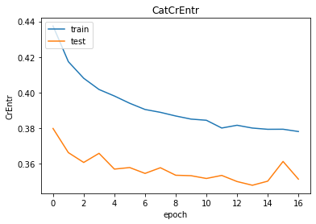

We can see though the loss is high it is much lower than the deeper, pretrained models described below.

A shallower network might help us..

Further tweaking and improvements will be added  to the above model and published here.

## Transfer Learning:

### VGG16:

#### input:

The images notEmnist_large zip were extracted to a directory and the images of 10 classes were given to the [keras image data generator](#keras_imgdatagen), with a validation split of 0.3, batch size of 64 was used, as of agumentation;

1. The images were normalised by scaling with 1/255.0.
2. A zoom range of [0.5,2] was applied.
3. images resized to 

The train data consited of 370385 images, while the test data had 158729 images. The train and test images are a split of notMnist_large itself.

#### Model:

The VGG16 model was imported from keras [applications](#keras_vgg16), with imagenet weights.
The last prediction layer was removed and replaced by a custom [Dense layer](#keras_dense), with 10 neurons(one for each class.).

Only the last few layers, with the custom layer highlited in  `Maroon` is displayed in the above figure, since the architecture is available online.

The model's layers, are frozen except for the last 3, which are left as trainable.

The model was compiled with [Adam](#keras_adam) as the optimizer, [categotical cross entropy](#keras_catcrent) as the loss function and [accuracy](#keras_acc) as the metric.

#### Callbacks, 

1. [Early stopping](#keras_es), monitoring the validation loss, with a patience of 3 and mode auto was used.
2. [ReduceLROnPlateau](#keras_reducelr), also monitoring the validation loss, with a patience of 3 and minimum learning rate of  was used.

#### Results:
On completion of training, and reduction of LR, below is the graph of the losses of the last few epochs;

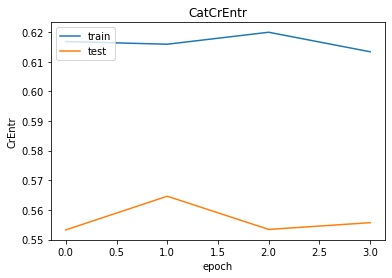

We can clearly see a divergance and not effective model with some heavy loss.

We would need to look into this further to try and fix it. As for this reason, we are not attempting to fit it in our open CV model to check realtime results.

### resNet50:

#### input:

The images notEmnist_large zip were extracted to a directory and the images of 10 classes were given to the [keras image data generator](#keras_imgdatagen), with a validation split of 0.2, batch size of 32 was used, as of agumentation;

1. The images were normalised by scaling with 1/255.0.
2. A zoom range of [0.5,2] was applied.
3. Width shift of 0.3
4. Height shitf of 0.3
5. both shits with a constaf fill of 190

The train data consited of 423295 images, while the test data had 105819 images. The train and test images are a split of notMnist_large itself.

#### Model:

The VGG16 model was imported from keras [applications](#keras_resnet50), with imagenet weights, with the parameter include top as False. This give us the model without the prediction layer. All of these layers were frozen, the input shape of the model changed to  which is the minimum shape allowed.

Another model was created and joined to the out put of the above model. These are the custom trainable layers of the ResNet50 implementation and they are as follows;

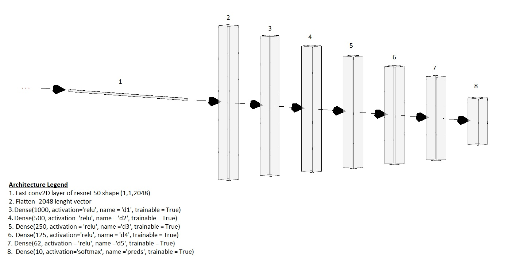

The model's layers, are frozen except for the last 3, which are left as trainable.

The model was compiled with [Adam](#keras_adam) as the optimizer, [categotical cross entropy](#keras_catcrent) as the loss function and [accuracy](#keras_acc) as the metric.

#### Callbacks, 

1. [Early stopping](#keras_es), monitoring the validation loss, with a patience of 3 and mode auto was used.
2. [ReduceLROnPlateau](#keras_reducelr), also monitoring the validation loss, with a patience of 3 and minimum learning rate set to auto.

#### Results:
On completion of training, and reduction of LR, below is the result of the last epoch;

Epoch 34/500
13227/13227 [==============================] - 345s 26ms/step - loss: 0.8264 - accuracy: 0.7230 - val_loss: 0.7797 - val_accuracy: 0.7424 - lr: 1.0000e-08

We can clearly see some heavy loss, thus rendering the model ununseable.

We would need to look into this further to try and fix it. As for this reason, we are not attempting to fit it in our open CV model to check realtime results.

### Since the best of the three models was the custom model so far, let us see how it fares in real time;

Predictions for A:
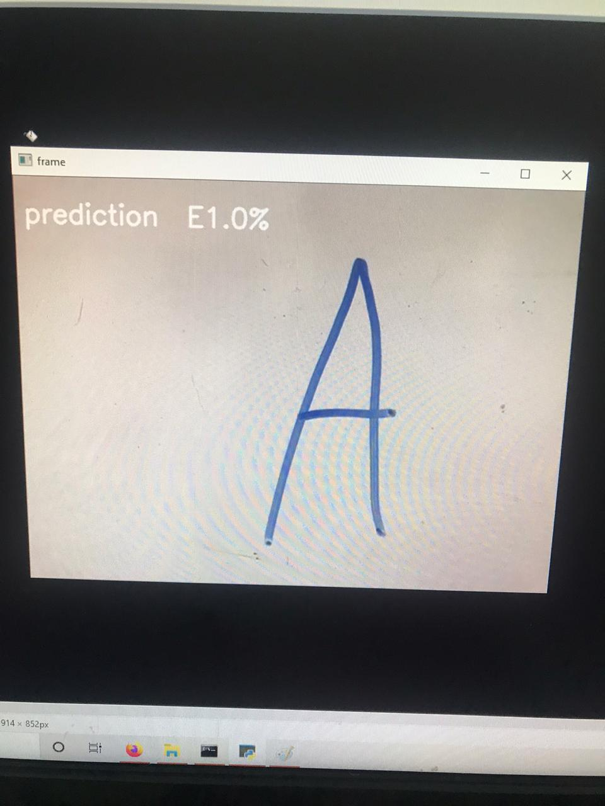

A is being predicted as E and H.

B is ok, it is being predicted as B and sometimes as H which is better than the others.

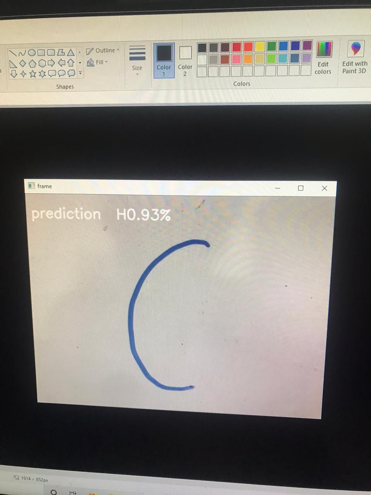

C is being predicted as A and H which is bad.

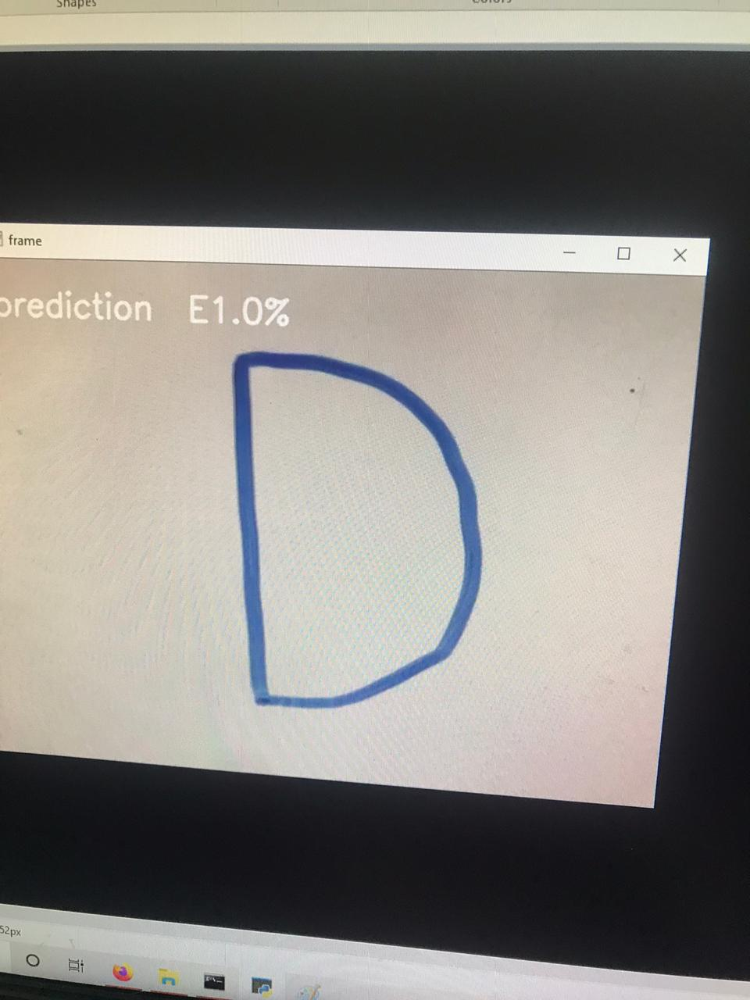
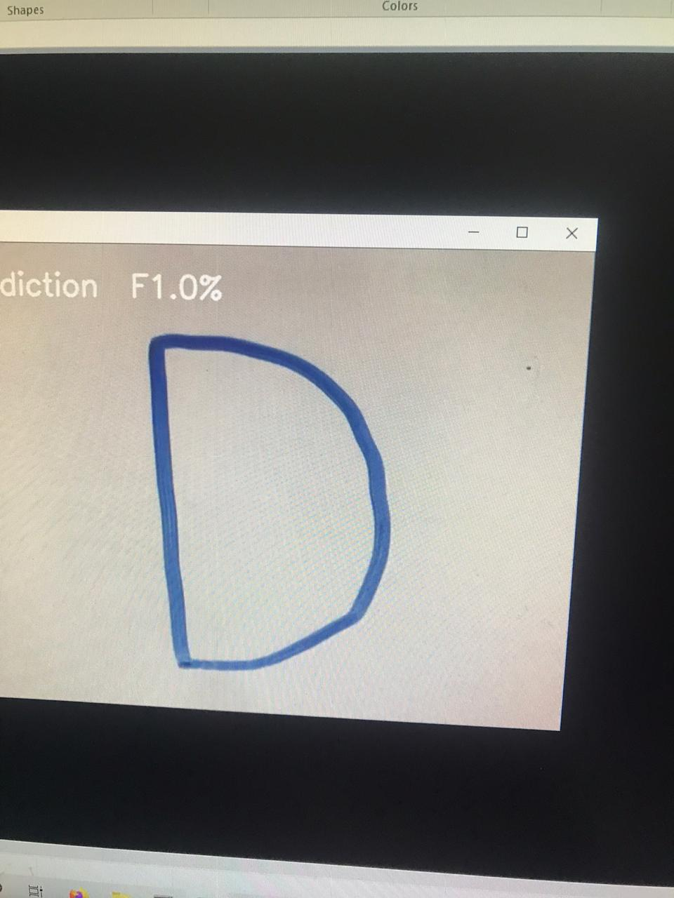

D is being predicted mostly as F and E. They do look a bit alike, but needs changes.

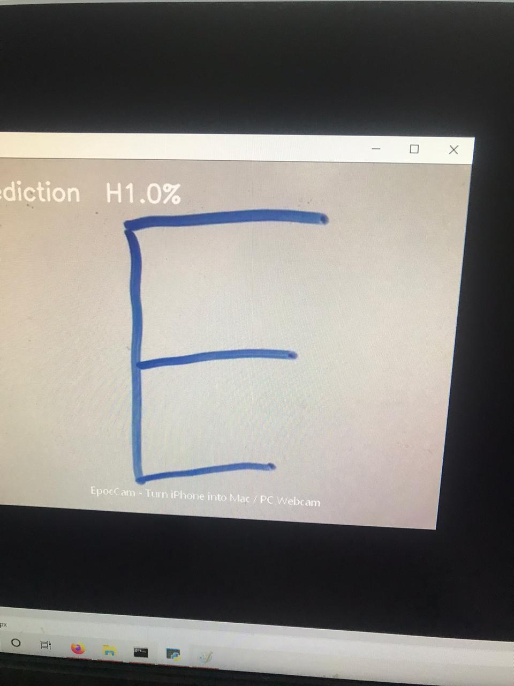
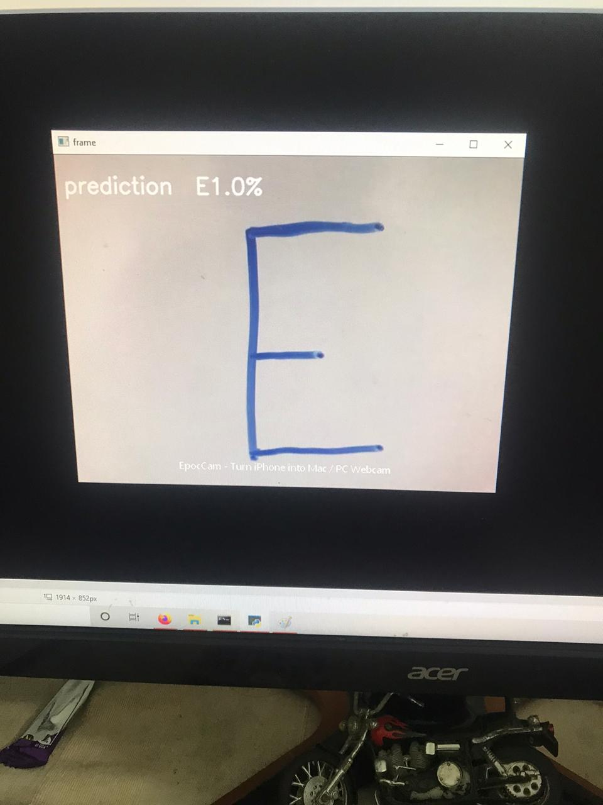

E is being predicted as H and E while we are getting E which is ok.

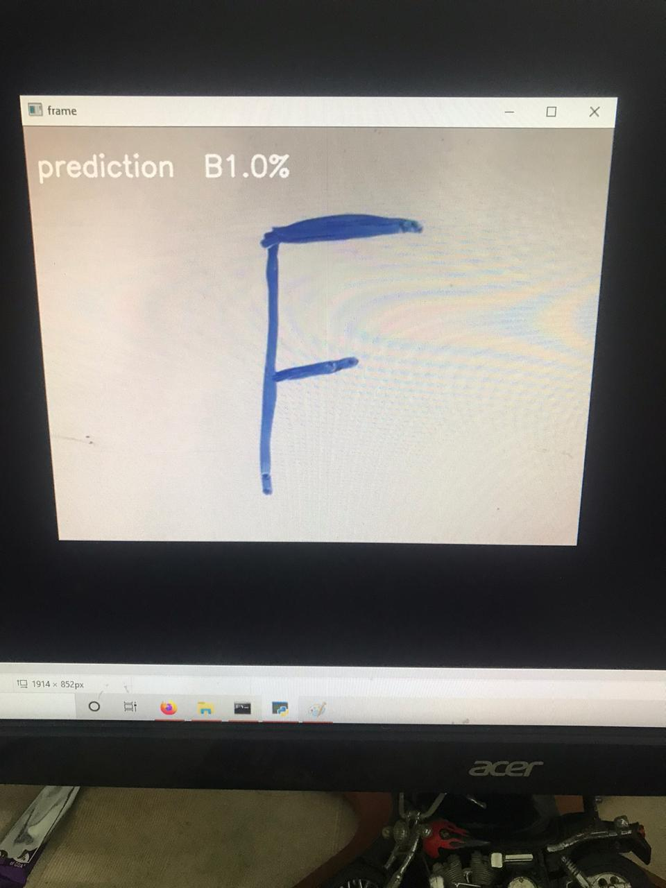

F is predicted as F and B while we are getting f it is ok.

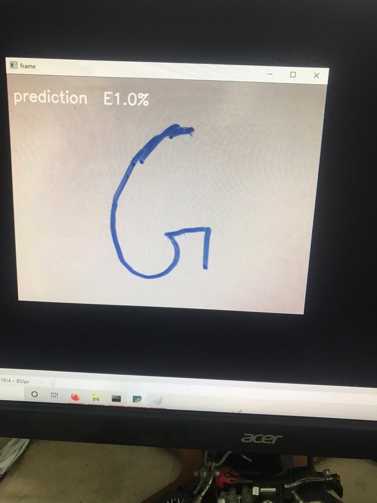

G is predicted E which is not good.
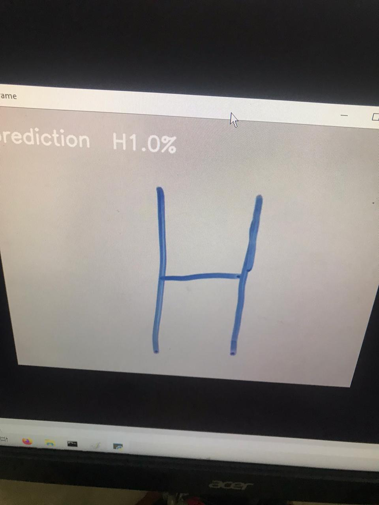
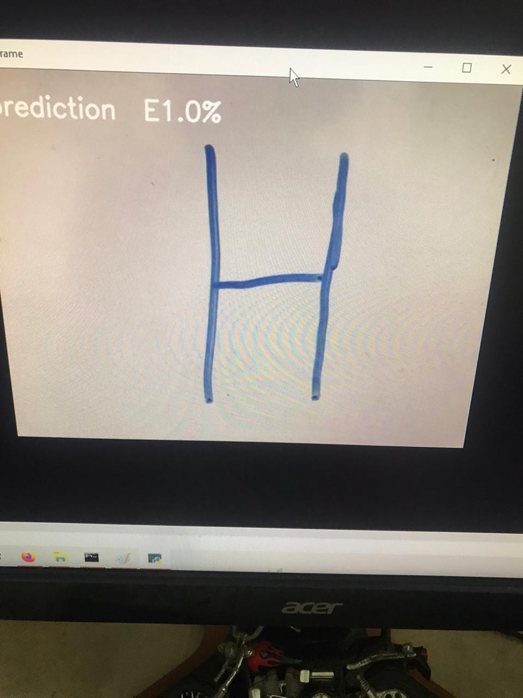

H is doing ok, while it is predicted as H and E.

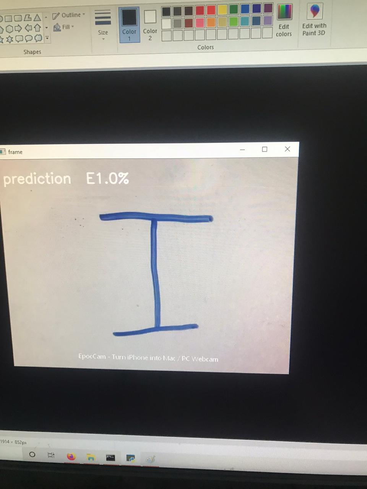

I is constantly predicted as E.

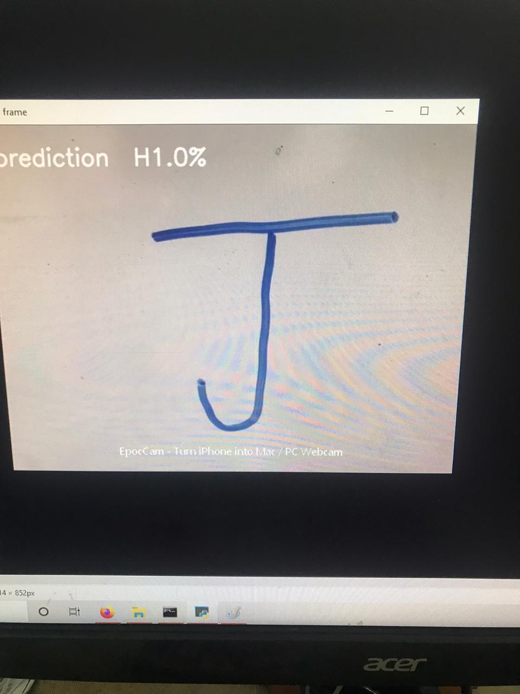

J us also being predicted as H.

H,E for reasons not explored so farm seem to be the dominant class though the labels are equally distributed. 

B, F and H seems be doing comparitively better than the remaining classes.

Based on further investigation, we will see if this approch is allright, or we should try another dataset. 

Try more models, use Large as trainset, and small as trainset. 

<b>References</b>

>1. **notMNIST dataset**
>
>Yaroslav Bulatov.[[notMNIST dataset](http://yaroslavvb.blogspot.com/2011/09/notmnist-dataset.html)](10-07-2020 PM)

>2. **keras Sequential Model**
>
>Keras.io.[[Sequential model](https://keras.io/guides/sequential_model/)](on 10-07-2020 PM)

>3. **Adam **
>
>Keras.io.[[Adam Optimizerl](https://keras.io/api/optimizers/adam/)](on 10-07-2020 PM)

>4. **Categorical Cross Entropy**
>
>Keras.io.[[CatCrEntr](https://keras.io/api/losses/probabilistic_losses/#categoricalcrossentropy-class)](on 10-07-2020 PM)

>5. **Accuracy**
>
>Keras.io.[[Accuracy](https://keras.io/api/metrics/accuracy_metrics/#accuracy-class)](on 10-07-2020 PM)

 
>6. **Early Stopping**
>
>Keras.io.[[EarlyStopping](https://keras.io/api/callbacks/early_stopping/)](on 10-07-2020 PM)

 
>7. **ReduceLronPlateau**
>
>Keras.io.[[ReduceLrOnPlateau](https://keras.io/api/callbacks/reduce_lr_on_plateau/)](on 10-07-2020 PM)

 
>8. **Image data generator**
>
>Keras.io.[[ImageDataGenerator](https://keras.io/api/preprocessing/image/#imagedatagenerator-class)](on 10-07-2020 PM)

 
>9. **Flow From Directory**
>
>Keras.io.[FlowFromDir](https://keras.io/api/preprocessing/image/#flow_from_directory-method)](on 10-07-2020 PM)

 
>10. **vgg16 keras**
>
>Keras.io.[vgg16](https://keras.io/api/applications/vgg/#vgg16-function)](on 10-07-2020 PM)

 
>11. **Keras Dense Layer**
>
>Keras.io.[Dense Layer](https://keras.io/api/layers/core_layers/dense/)](on 10-07-2020 PM)

 
>11. **ResNet50**
>
>Keras.io.[ResNet50](https://keras.io/api/applications/resnet/#resnet50-function)](on 10-07-2020 PM)
