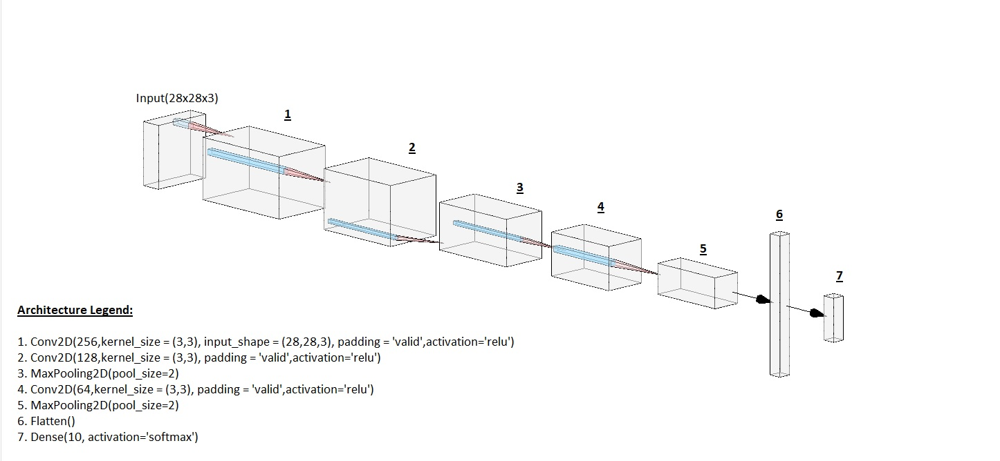

# Probing the notMNIST dataset
---
## About the data:
The data set consists of glyphs taken from publically available fonts. There are 10 classes A,B...J. Blow are a few axamples of A

There are two variants, notMnist Large, which is not clean and consits of about 500k glyphs of each class and notMnistsmall, which is handpicked to be more clean, have about 1,800 glyphs per class. both parts have approximately 0.5% and 6.5% label error rate. [[1](#blog_dest)] 

## Abstract:
*An attempt to achieve better results than previously obtained 89% with logistic regression on top of stacked auto-encoder with fine-tuning[[1](#blog_dest)] is being made in this repo. We intend to do this by applying various finetuned pre-trained models and by building custom models using the keras API, and the openCV module to make live predictions on actual hand-written alphabets.* 

With a trial and error uproach in mind, the following attempts were made to build a neural network from scratch to predict the alphabets;

## Custom Convolutional Neural networks:

### Initial model:

#### Input:

The images notEmnist_large zip was extracted to a directory and the images of 10 classes were given to the [keras image data generator](https://keras.io/api/preprocessing/image/), with a validation split of 0.3, batch size of 32 was used and no agumentation. The train data consited of 370385 images, while the test data had 158729 images. The train and test images are a split of notMnist_large itself.

#### Model:

The first attempted model is a squential[[2](#keras_seq)]  keras model, of 7 layers, with seven (3x3) convolutions, two maxpooling layers with a pool zise of 2, a flatten layer and as the output, a dense layer with 10 neurons, one for each class.

The model was compiled with [Adam](https://keras.io/api/optimizers/adam/) as the optimizer, [categotical cross entropy](https://keras.io/api/losses/probabilistic_losses/#categoricalcrossentropy-class) as the loss function and [accuracy](https://keras.io/api/metrics/accuracy_metrics/#accuracy-class) as the metric.

#### Callbacks, 

1. [Early stopping](https://keras.io/api/callbacks/early_stopping/), monitoring the validation loss, with a patience of 3 and mode auto was used.
2. [ReduceLROnPlateau](https://keras.io/api/callbacks/reduce_lr_on_plateau/), also monitoring the validation loss, with a patience of 3 and minimum learning rate of  was used.

<b>References</b>

>1. **notMNIST dataset**
>
>Yaroslav Bulatov.[[notMNIST dataset](http://yaroslavvb.blogspot.com/2011/09/notmnist-dataset.html)](at 10-07-2020, 18:00)

>2. **keras Sequential Model**
>
>Keras.io.[[Sequential model](https://keras.io/guides/sequential_model/)](on 10-07-2020 at 18:00)

